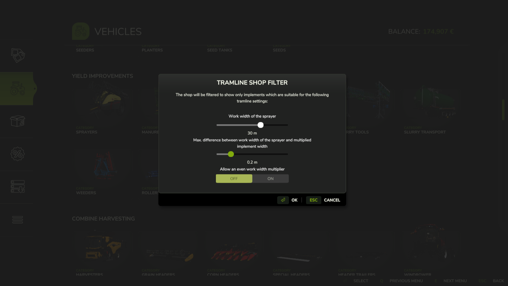
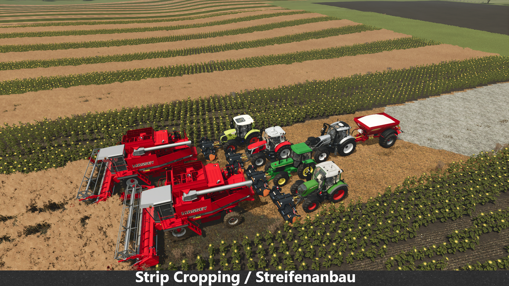
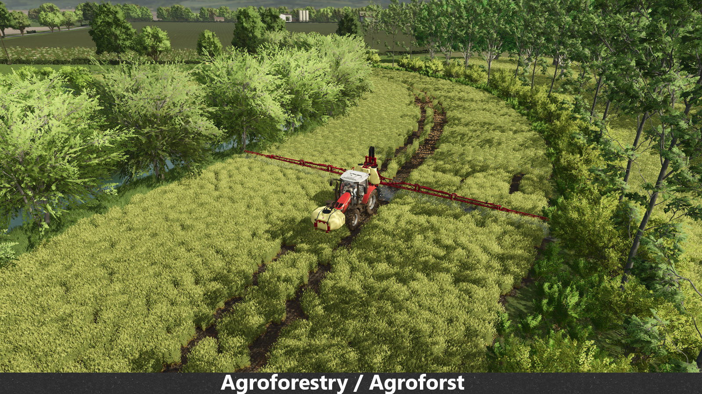
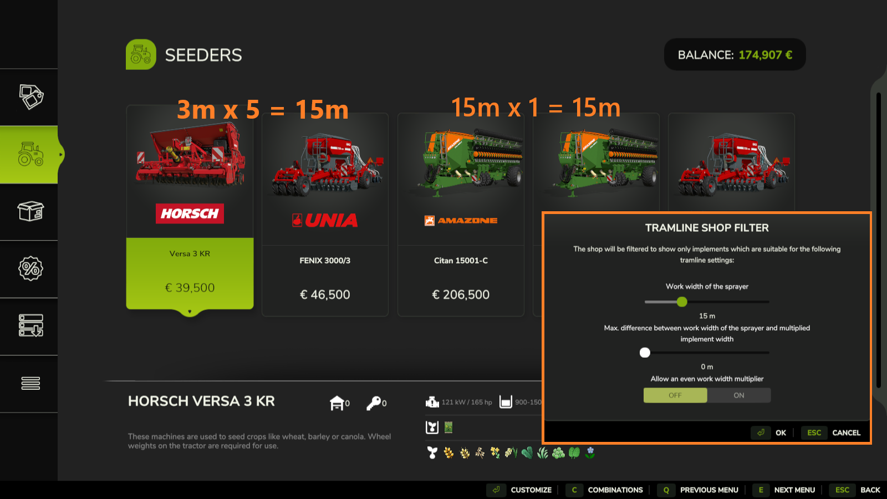
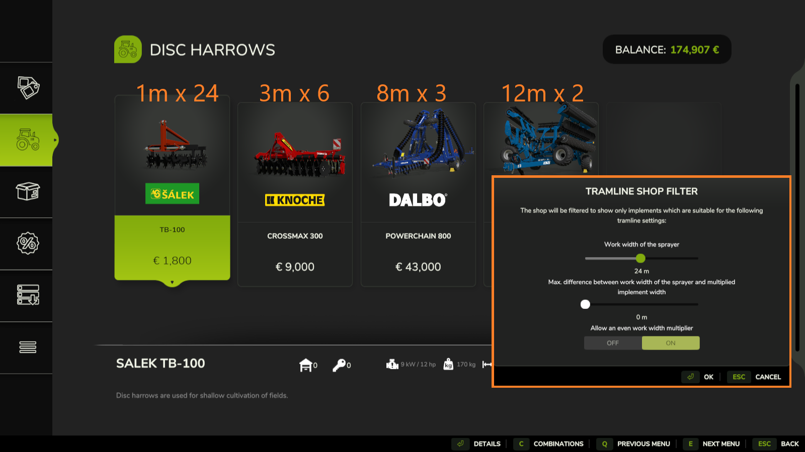
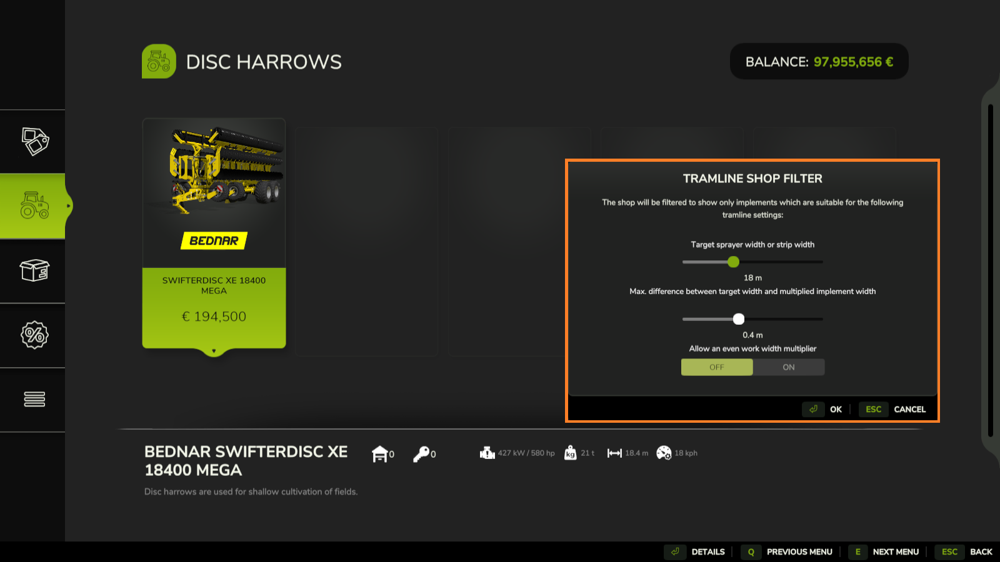

# FS25_TramlineShopFilter

## Acknowledgements

## Modhub Link

not available yet

## Mod description

This mod allows filtering the shop for work widths which are compatible with a target tramline (or strip) width.
This is intended for players who are playing with tramlines/CTF and especially players who are practicing strip cropping, alley cropping (agroforestry) or similar.

## Screenshots

## How to install

1. Download the newest zip from the [Releases page](https://github.com/Timmeey86/FS25_TramlineShopFilter/releases)
1. Place the zip file in your FS25 mod folder
1. Start the game and use like any other mod

## How to debug/code

1. Obviously, own a copy of Farming Simulator 25
1. Clone this folder anywhere
1. Use Visual Code with at least the Lua Language Server Plugin for coding
1. When testing, execute copytofs.bat
1. Debug in Giants Studio or just launch the game
